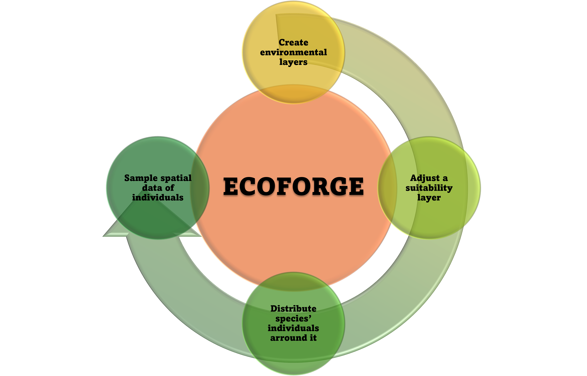

An R package with a set of tools for simulating spatial data: ecological environments and generate species' counts or presence/absence data for ecological analyses.

## What is Ecoforge?

The purpose of **Ecoforge** is to [simulate natural processes in space for subsequent analysis]{.underline}. This package enables you to: 1)create new spatial environmental layers (predictors), 2)adjust a spatial suitability layer based on this environmental layers, 3)distribute the species' individuals around it, and 4)obtain sampled data of the species (abundance and detections), with an extra example to check the collinearity between variables.



It allows researchers to:

-   Simulate spatial layers of environmental variables with varying degrees of spatial autocorrelation (climate, vegetation, land use, etc.).

-   Generate spatial layers of environmental suitability for virtual species, as well as distribute individuals as spatial points across their surface.

-   Apply different sampling strategies (using point counts or transects, and employing uniform or random sampling) to the simulated individuals.

-   Convert the simulated data into presence/absence or count formats ready for use in various spatial ecology models (e.g., habitat selection studies, species distribution models, etc.).

This website provides all the information and details about the functions included in the package, as well as some examples of complete simulation vignettes.

## When should I use Ecoforge?

*EcoForge* is particularly useful when controlled and reproducible scenarios are needed. For example:

-   Testing the performance of spatial models under known conditions
-   Evaluating the effect of sampling design on model accuracy
-   Teaching and demonstrating concepts in ecological modelling

## Instalation

``` r
# install.packages("devtools")
devtools::install_github("NatureProtectionDFF/Ecoforge-R-package")

library(ecoforge)
ls("package:ecoforge")
```

## Functions descriptions

-   [abundance2pres](reference/abundance2pres.html)
-   [countOcc](reference/countOcc.html)
-   [generateClim](reference/generateClim.html)
-   [generateMonthlyPrec](reference/generateMonthlyPrec.html)
-   [generateMonthlyTemp](reference/generateMonthlyTemp.html)
-   [generatePoints](reference/generatePoints.html)
-   [generateVar](reference/generateVar.html)
-   [logistic](reference/logistic.html)
-   [pointSample](reference/pointSample.html)
-   [randomSamp](reference/randomSamp.html)
-   [scale01](reference/scale01.html)
-   [transectSample](reference/transectSample.html)
-   [uniformSamp](reference/uniformSamp.html)

## Available vignettes

-   [Ferrer-Ferrando et al. Ecography](vignettes/Ferrer-Ferrando_etal_Ecography/Simulation.vignette.html)
-   [Package Example](vignettes/Package_Example/QUARTO_ECOFORGE_HTML_PDF.html)

## Citation

For now, there is only one article available that uses some of its features as a reference. So if you use EcoForge in your research, please cite this work:

-   Ferrer-Ferrando, D., Tarroso, P., Luis Tellería, J., Acevedo, P. and Fernández-López, J. (2025), *Disentangling the effect of the spatial scale and species spatial pattern on the abundance–suitability relationship*. Ecography, 2025: e07766. https://doi.org/10.1111/ecog.07766

We will soon have a software note focused on this package available as a citation reference.
