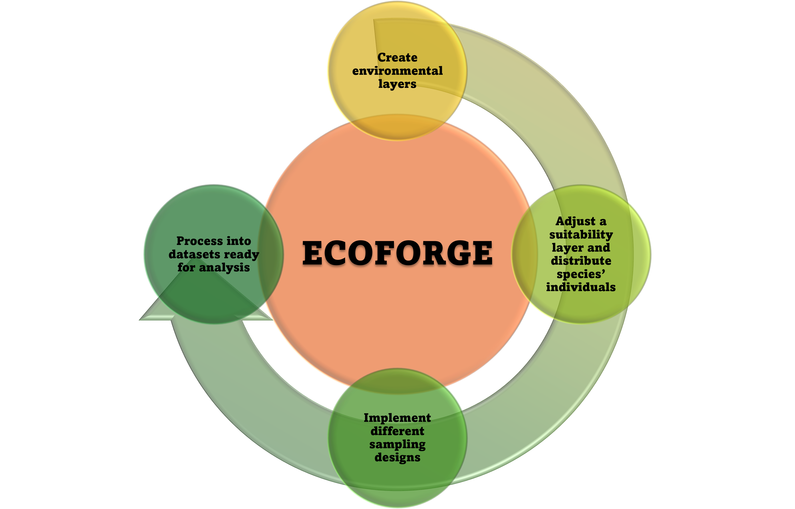

::: {style="overflow: hidden; margin-bottom: 1.5rem;"}


<h1 style="font-style: italic; font-weight: bold;">

Simulating environments and species for spatial ecological analysis

</h1>

<p>An R package with a set of tools for simulating spatial data: ecological environments and generate species' counts or presence/absence data for ecological analyses.</p>
:::

## What is Ecoforge?

The purpose of **Ecoforge** is to [simulate natural processes in space for subsequent analysis]{.underline}. This package enables you to:

1.  Create new spatial environmental layers (predictors)

2.  Adjust a spatial suitability layer based on this environmental layers

3.  Distribute the species' individuals around it

4.  Obtain sampled data of the species (abundance and detections)

With an extra example to check the collinearity between variables.



It allows researchers to:

-   Simulate spatial layers of environmental variables with varying degrees of spatial autocorrelation (climate, vegetation, land use, etc.).

-   Generate spatial layers of environmental suitability for virtual species, as well as distribute individuals as spatial points across their surface.

-   Apply different sampling strategies (using point counts or transects, and employing uniform or random sampling) to the simulated individuals.

-   Convert the simulated data into presence/absence or count formats ready for use in various spatial ecology models (e.g., habitat selection studies, species distribution models, etc.).

This website provides all the information and details about the functions included in the package, as well as some examples of complete simulation vignettes.

## When should I use Ecoforge?

*EcoForge* is particularly useful when controlled and reproducible scenarios are needed. For example:

-   Testing the performance of spatial models under known conditions
-   Evaluating the effect of sampling design on model accuracy
-   Teaching and demonstrating concepts in ecological modelling

## Installation

``` r
# install.packages("devtools")
devtools::install_github("NatureProtectionDFF/Ecoforge-R-package")

library(ecoforge)
ls("package:ecoforge")
```

## Functions Reference

Ecoforge functions are organized following the logical steps of a virtual ecology workflow. Functions are grouped according to the procedure being carried out: (A) generating the spatial patterns of environmental variables, (B) transforming that information into different ranges or distributions, (C) generating the spatial patterns of the target species, and (D) collecting data from those spatial patterns with different sampling strategies, and preparing them in a format suitable for the models to be applied (Figure 2).


### Create environment spatial pattern

Functions to generate modulated spatially autocorrelated environmental variables using Gaussian simulations with a Spherical model.

| Function | Description |
|--------------------------------|----------------------------------------|
| [`generateVar()`](reference/generateVar.html) | Generates a single variable (e.g. vegetation, terrain) with modulated spatial autocorrelation |
| [`generateClim()`](reference/generateClim.html) | Generates a full climate dataset including temperature and precipitation with modulated spatial autocorrelation |
| [`generateMonthlyTemp()`](reference/generateMonthlyTemp.html) | Derives monthly minimum, average and maximum temperature from annual data, based on 'generateClim()' output |
| [`generateMonthlyPrec()`](reference/generateMonthlyPrec.html) | Derives monthly precipitation from annual data with seasonal pattern, based on 'generateClim()' output |

### Data transformation

Utility functions to rescale or transform variables and suitabilty patterns before using them to generate species' data.

| Function | Description |
|--------------------------------|----------------------------------------|
| [`scale01()`](reference/scale01.html) | Linearly rescales any variable to the \[0, 1\] range |
| [`logistic()`](reference/logistic.html) | Applies a logistic transformation to control distibution of data frequency |

### Create species spatial pattern

Generates virtual species occurrences in space based on a suitability layer, simulating an inhomogeneous Poisson point process.

| Function | Description |
|--------------------------------|----------------------------------------|
| [`generatePoints()`](reference/generatePoints.html) | Distributes individuals as points across the landscape according to habitat suitability |

### Sampling data (I)

Functions to first define survey locations and and then simulate field sampling procedures, returning detection distances for each individual inside the detection area of the sampling unit.

| Function | Description |
|--------------------------------|----------------------------------------|
| [`uniformSamp()`](reference/uniformSamp.html) | Places survey sites on a regular systematic grid |
| [`randomSamp()`](reference/randomSamp.html) | Places survey sites at random positions within a grid |
| [`pointSample()`](reference/pointSample.html) | Simulates point count surveys within a detection radius |
| [`transectSample()`](reference/transectSample.html) | Simulates line transect surveys within a detection range |

### Sampling data (II)

Functions to convert raw sampling output (distances for each individual inside the detection area) into formats ready for the models to be applied.

| Function | Description |
|--------------------------------|----------------------------------------|
| [`countOcc()`](reference/countOcc.html) | Counts of detected individuals per survey site |
| [`abundance2pres()`](reference/abundance2pres.html) | Converts abundance counts to presence/absence considering imperfect detection |

## Available vignettes

-   [Ferrer-Ferrando et al. Ecography](vignettes/Ferrer-Ferrando_etal_Ecography/Simulation.vignette.html)
-   [Package Example](vignettes/Package_Example/QUARTO_ECOFORGE_HTML_PDF.html)

## Citation

For now, there is only one article available that uses some of its features as a reference. So if you use EcoForge in your research, please cite this work:

-   Ferrer-Ferrando, D., Tarroso, P., Luis Tellería, J., Acevedo, P. and Fernández-López, J. (2025), *Disentangling the effect of the spatial scale and species spatial pattern on the abundance–suitability relationship*. Ecography, 2025: e07766. https://doi.org/10.1111/ecog.07766

We will soon have a software note focused on this package available as a citation reference.
